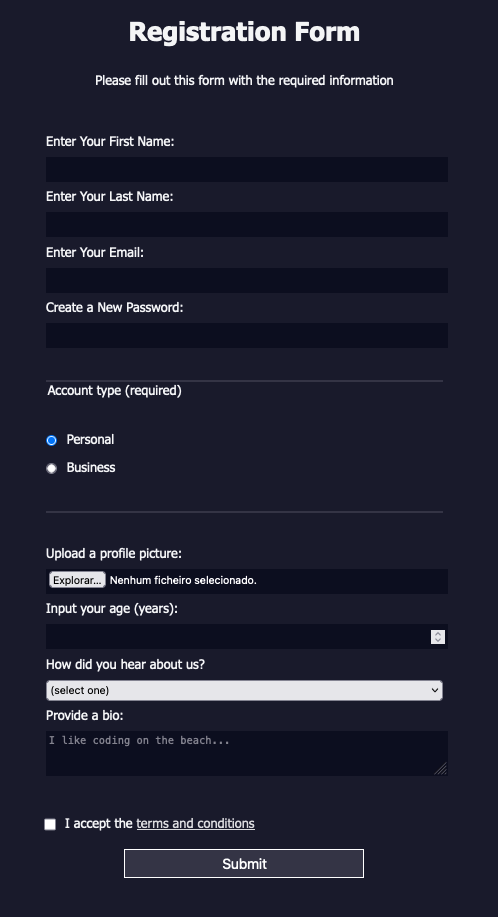

# SIGN UP FORM

A basic registration form from a freeCodeCamp project, implementing best practices.

## Semantic and Accessibility

This form includes:
- Proper <code>label</code> and <code>input</code> pairing with <code>for</code> and <code>id</code> attributes to ensure accessibility.
- The use of <code>fieldset</code> and <code>legend</code> for grouping related fields.

## Form preview

## Inspiration

Here are some form examples to get inspired:

- [20 Best Sign Up Form Examples and Design Tips](https://wisernotify.com/blog/best-signup-form-examples/)

- [Material Design guidelines](https://m3.material.io/components/text-fields/)

## To-Do

- Set up a mobile-friendly layout
- Add feedback style for invalid fields 